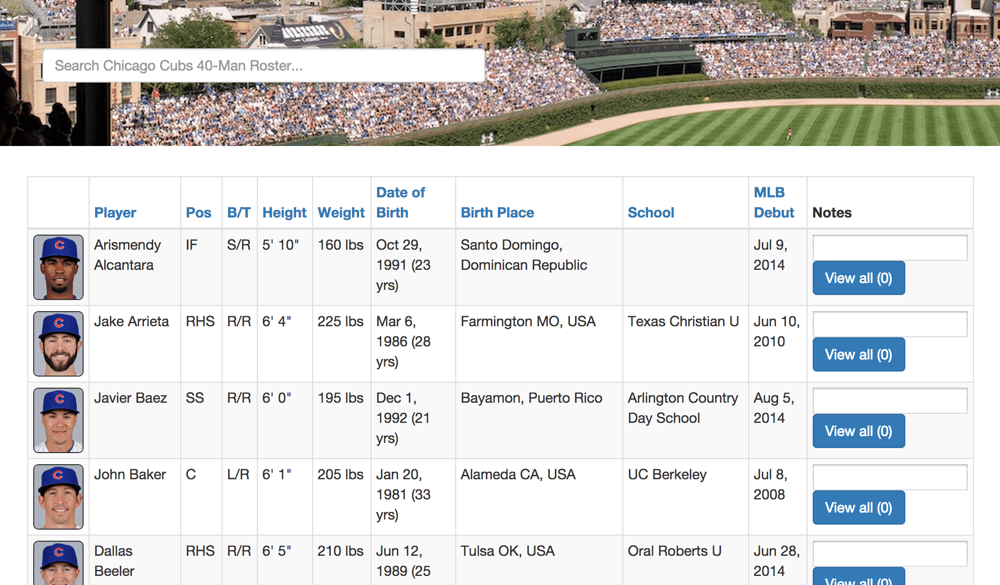
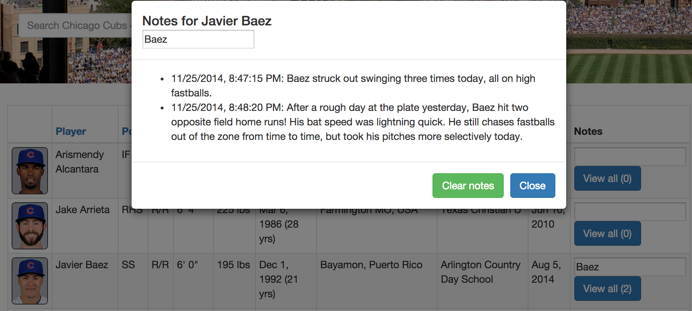

# mlb-angular

## Overview
This project was built with AngularJS, a JavaScript framework maintained by Google.




## Instructions
Install this project's dependencies with the Bower package manager. If you do not have Bower installed, install it globally by executing ```sudo npm install -g bower```, then within the mlb-angular folder, run the following command:
```
bower install
```
This installs mlb-angular's dependencies, including AngularJS 1.3, Twitter Bootstrap 3.3, and so on. Now install your Node modules, then fire up your Node server:
```
npm install
npm start
```
This starts a simple HTTP server from which to serve the application. To view the application, open ```localhost:8000``` in your favorite web browser.

## Technologies Discussion
#### AngularJS: Data-binding, ng-repeat, ng-click, and ng-submit
AngularJS is a JavaScript framework for dynamic web applications. It extends HTML's syntax beyond a declarative language of static web pages towards dynamic web applications that make use of two-way data-binding (model-to-view, view-to-model). In our application, we make use of data-binding by binding both the model to the view and the view to the model, starting with [roster.json](roster.json) and adding additional properties, such as fullname, batthrows, and notes in order to manipulate the view's table contents.

In our Bootstrap-powered table, a ```tr``` tag is repeated for each player contained in ```roster.json```, by defining the value of the ```ng-repeat``` attribute in the ```tr``` tag. "For player in players, repeat the following ```tr``` HTML code." Similarly, defining the ```ng-click``` attribute in the ```th``` header tags allow us to sort the roster table by different columns, using the filter ```orderBy``` to order arrays by the predicate.

Finally, our view binds data to the model via the ```ng-submit``` attribute in the player forms. Upon submitting a value (i.e. pressing 'enter' after typing a player note), that player object's ```submit()``` function is called, which pushes the datetime string and submitted text to the player object's notes list. If you open up the browser's console, you can see the player object and the player object's notes list logged to console each time you submit a player note.

In summary, we use AngularJS as a JavaScript framework to add dynamic functionality to our HTML page with relatively few lines of code to create nice interaction.

#### Bower: Package installation from bower.json manifest
Bower is a package manager that keeps track of dependencies in this application. AngularJS, Bootstrap, jQuery (required for Bootstrap's JavaScript plugins, such as ```modal.js```), and angular-local-storage are the four required dependencies for this project. Any user who wants to fork this repository and host this web application on their own machine would only need to execute a simple ```bower install``` to bring all the required components into the repository. We can also specify and manage the versions of each component we install as seen in the ```bower.json``` file. This is a good alternative to hard-coding CDN links into script tags in ```index.html```, while manageable for a mini application like this one, would become increasingly tedious and prone to human error with a much larger web application.

#### Bootstrap: Grid system, tables, buttons, and modals
Bootstrap is a responsive HTML/CSS/JS framework used primarily for templates. In this project, we use Bootstrap to rapidly prototype the web application's look. Bootstrap's grid system helps us easily layout the HTML. Bootstrap tables have built-in classes such as ```table-striped``` and ```table-hover``` so that our table looks professional without modifying any custom CSS. Our buttons also look Bootstrap-professional, in Bootstrap's signature rounded buttons, used on our 'View all' buttons for each player record, as well as the 'Clear notes' and 'Close' buttons on each player's notes modal. Finally, the player's notes modal is a nifty JavaScript-built dialog prompt. With minimal HTML code, we can navigate to a dialog box for each player we want to view the notes of, and easily close it to return to the main page.

#### angular-local-storage: HTML5 web storage
[angular-local-storage](https://github.com/grevory/angular-local-storage) is an AngularJS module that gives our application access to the browser's local storage or cookies if local storage is not supported by the browser viewing the application. We use this module in order to persist notes data in web storage, so that when we refresh the webpage or launch the web application the next day, each player's notes are stored. It works by setting a value to a key using a local storage service. In our application, we set the key ```player.player_id_mlbam``` with the value ```player.notes``` after pushing a submitted text message to the notes list inside the player object's ```submit()``` function. We also get the value stored given the key to initialize each player's notes, if there is a list of notes stored locally. Take a look at the code in our [commit here](https://github.com/albertlyu/interview-developer/commit/8ce38e170b009b2504ecf629c6ddba2596320303) to see how ```localStorageService.get(key)``` and ```localStorageService.set(key,value)``` are implemented in our application. Additionally, [this commit](https://github.com/albertlyu/interview-developer/commit/7ee5df4dc7bc5dfdfc7490a87f17fa630b116183) with functionality to clear notes for each player shows us how ```localStorageService.remove(key)``` is used in the ```player.reset()``` function.

## To Do
- [x] Load roster.json via controller
- [x] Convert inches to feet, date of birth to age
- [x] Add mug shots, including default mugshot for C.J. Edwards
- [x] Add orderBy filter on expression predicate
- [x] Add search bar
- [x] Create modal to save and view player notes
- [x] Manage dependencies with Bower
- [x] Persist notes data using [angular-local-storage](https://github.com/grevory/angular-local-storage)
- [x] Add Wrigley Field as background image
- [x] Add screenshot of application